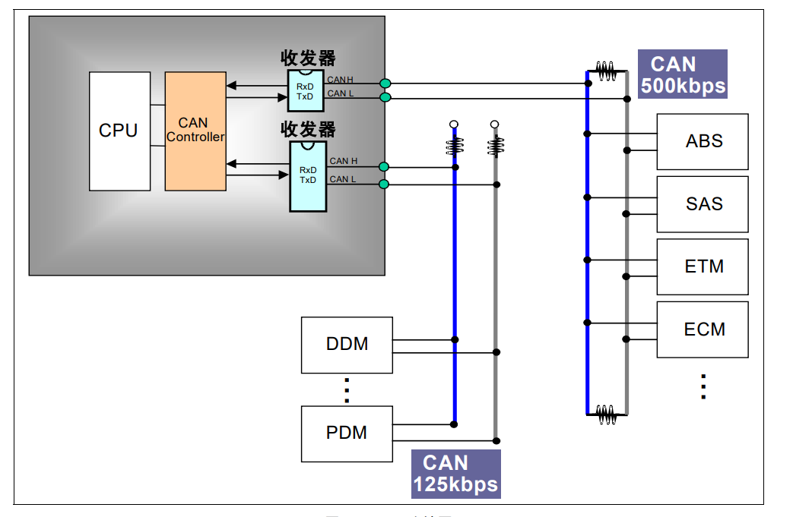

# CAN通信
## 一、基础知识
### 1. 硬件
#### （a）硬件接线

#### （b）电平信号
* CAN_High
* CAN_Low
* 隐形电平1（CAN_High==CAN_Low）
* 显性电平0（CAN_High!=CAN_Low）
#### （c）邮箱

### 2. 软件
#### （a）帧的种类
* 数据帧：用于发送单元向接收单元传送数据的帧

id+length+data+验证码
* 遥控帧：用于接收单元向具有相同 ID 的发送单元请求数据的帧
* 错误帧：用于当检测出错误时向其它单元通知错误的帧（硬件自动完成）
* 过载帧：当一个节点正忙于处理接收的信息，可以通知其它节点暂缓发送新报文（硬件自动完成）
* 帧间隔：用于将数据帧及遥控帧与前面的帧分离开来的帧（硬件自动完成）
#### （b）仲裁

1. 在总线空闲时，最先开始发送的节点获得发送权，一旦开始发送，不会被其他节点抢占。
2. 多个节点同时开始发送时，各发送节点从仲裁段的第一位开始进行仲裁。连续输出显性电平最多的节点可继续发送。(Dominant ：显性优先)
3. 具有相同ID的数据帧和遥控帧在总线上竞争时，仲裁段的最后一位（RTR）为显性位的数据帧具有优先权可继续发送。
4. ​标准格式ID与具有相同ID的遥控帧或者扩展格式的数据帧在总线上竞争时，标准格式的RTR 位为显性位的具有优先权可继续发送。
#### （c）过滤器
* 掩码模式（x2x1）
* 列表模式（0011）
#### （d）波特率
* CAN波特率=APB总线频率/分频系数/（TBS1+TBS2+SJY）
* CAN波特率=TQ*(TBS1+TBS2+SJY)